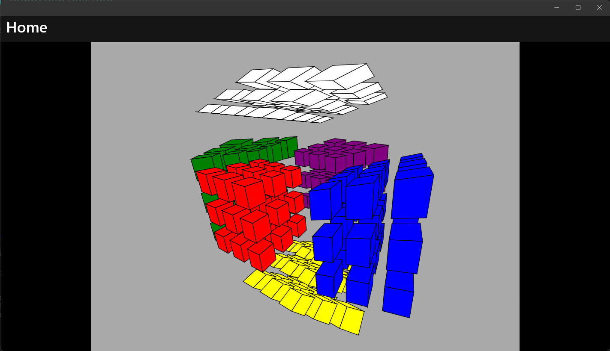

# HyperRubiksCube

A 4D Rubik's Cube.

## How to Play

Drag to spin/gyrospin.
Right click to switch between spin mode and gyrospin mode.

It still cannot turn like a Rubik's cube, I'm working on it.

## License

MIT
